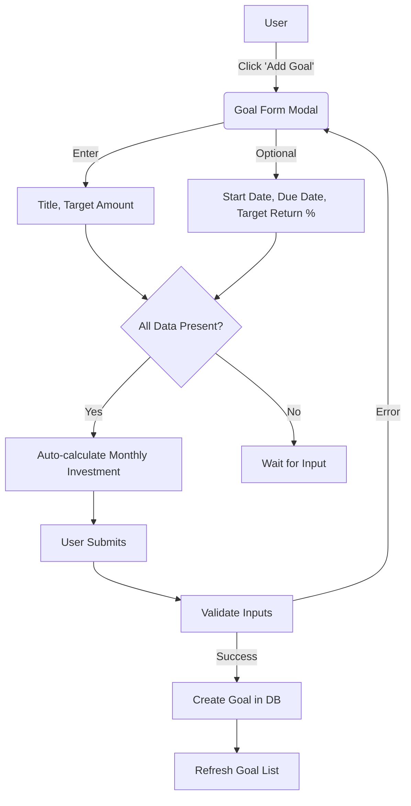
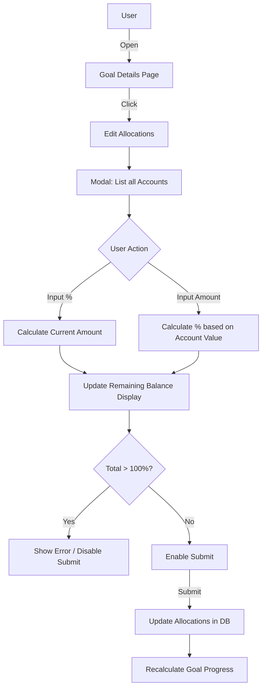
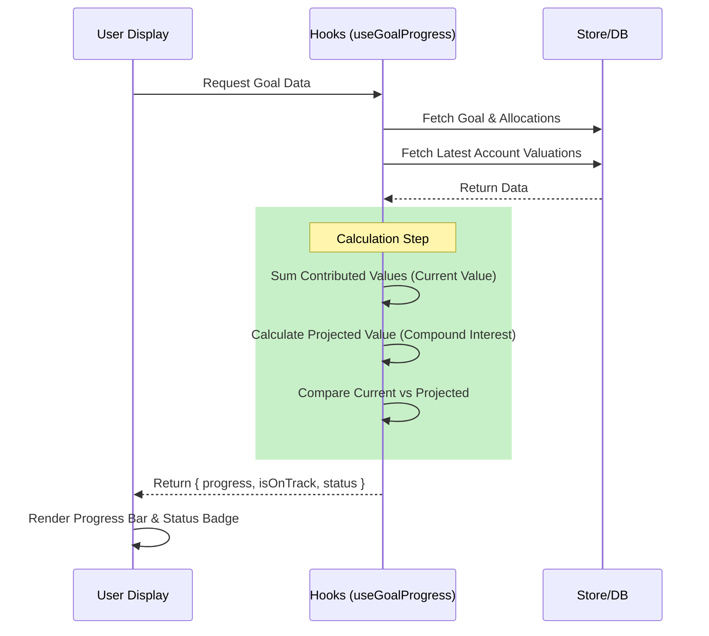

# Goal Page Business Logic

This document describes the business logic, formulas, and component interactions
for the Goals feature in WealthVN.

## Table of Contents

1. [Overview](#overview)
2. [User Flows](#user-flows)
3. [Core Data Types](#core-data-types)
4. [Goals Page (`goals-page.tsx`)](#goals-page)
5. [GoalItem Component](#goalitem-component)
6. [Goal Allocations Table](#goal-allocations-table)
7. [Goal Form (Add/Edit)](#goal-form)
8. [Key Formulas](#key-formulas)
9. [Business Rules](#business-rules)

---

## Overview

The Goals feature allows users to:

- Create financial goals with target amounts and timelines
- Allocate portions of their investment accounts toward specific goals
- Track progress through contributed value calculations
- Monitor if they're on/off track based on projected vs actual values

## User Flows

### 1. Create New Goal



### 2. Manage Allocations

This flow describes how users assign account funds to goals.



### 3. Track Progress (Auto)

How the system determines if a goal is "On Track".



### File Structure

| Component            | Location                                          |
| -------------------- | ------------------------------------------------- |
| Goals Page           | `src/pages/goals/goals-page.tsx`                  |
| Goal Details Page    | `src/pages/goals/goal-details-page.tsx`           |
| GoalItem             | `src/pages/goals/components/goal-item.tsx`        |
| GoalAllocations      | `src/pages/goals/components/goal-allocations.tsx` |
| GoalForm             | `src/pages/goals/components/goal-form.tsx`        |
| useGoalProgress Hook | `src/pages/goals/use-goal-progress.ts`            |
| Goal Utils           | `src/pages/goals/lib/goal-utils.ts`               |
| Goal Commands        | `src/commands/goal.ts`                            |

---

## Core Data Types

### Goal Interface

```typescript
interface Goal {
  id: string;
  title: string;
  description?: string;
  targetAmount: number; // The target value to reach
  targetReturnRate?: number; // Expected annual return rate (0-100%)
  isAchieved?: boolean; // Manually marked as complete
  dueDate?: string; // ISO date string - when goal should be achieved
  monthlyInvestment?: number; // Monthly DCA contribution amount
  startDate?: string; // ISO date string - when goal tracking begins
  allocations?: GoalAllocation[];
}
```

### GoalAllocation Interface

```typescript
interface GoalAllocation {
  id: string;
  goalId: string;
  accountId: string;
  initialContribution: number; // Locked initial amount at allocation start
  allocatedPercent: number; // Percentage of account GROWTH attributed to goal (0-100)
  allocationDate?: string; // YYYY-MM-DD format - when allocation becomes active
}
```

### GoalProgress Interface (Internal)

```typescript
interface GoalProgress {
  goalId: string;
  currentValue: number; // Current contributed value
  targetAmount: number; // Target from goal
  progress: number; // Percentage (0-100)
  expectedProgress: number; // Timeline-based expectation
  isOnTrack: boolean; // currentValue >= projectedValue
  projectedValue: number; // Expected value at today based on plan
}
```

---

## Goals Page

**File:** `src/pages/goals/goals-page.tsx`

### Data Flow

1. **Fetch Goals** - Query all goals from backend
2. **Fetch Allocations** - Query all goal allocations
3. **Fetch Latest Valuations** - Get current account values (NOT
   account.balance)
4. **Calculate Progress** - Use `useGoalProgress` hook to compute each goal's
   progress

### Key Implementation

```typescript
// Get latest account valuations (source of truth for account values)
const { latestValuations } = useLatestValuations(accountIds);

// Build current account values map
const currentAccountValuesFromValuations = new Map(
  (latestValuations || []).map((val) => [val.accountId, val.totalValue]),
);

// Calculate progress for each goal
const { getGoalProgress } = useGoalProgress(goals);
```

### Display Elements

- **Goal Cards Grid** - 3-column responsive grid of GoalItem components
- **Allocations Table** - Read-only matrix showing all goal-account allocations
- **Empty State** - Placeholder when no goals exist

---

## GoalItem Component

**File:** `src/pages/goals/components/goal-item.tsx`

### Props

```typescript
interface GoalItemProps {
  goal: Goal;
  currentValue?: number; // Calculated contributed value from allocations
  progress?: number; // Percentage (0-100)
  isOnTrack?: boolean; // Actual >= Projected
  allocations?: GoalAllocation[]; // Allocations for this specific goal
  totalAccountCount?: number; // Total number of accounts in portfolio
  onEdit: (goal: Goal) => void;
  onDelete: (goal: Goal) => void;
}
```

### Display Elements

| Element              | Source              | Description                                        |
| -------------------- | ------------------- | -------------------------------------------------- |
| **Title**            | `goal.title`        | Goal name                                          |
| **Status Badge**     | Computed            | Completed/Not Started/Overdue/Ongoing              |
| **Allocation Badge** | Computed            | Average allocation percentage across accounts      |
| **Current Value**    | `currentValue` prop | Formatted currency value                           |
| **Target Value**     | `goal.targetAmount` | Formatted currency value                           |
| **Progress Bar**     | `progress` prop     | Visual percentage with color based on track status |
| **Track Status**     | `isOnTrack` prop    | "On Track" / "Off Track" / "Done"                  |

### Allocation Badge Calculation

The allocation badge shows the **average allocation percentage** across all
accounts:

```typescript
// Number of accounts allocated to this goal
const allocationCount = allocations.length;

// Sum of all allocation percentages for this goal
const totalAllocationPercent = allocations.reduce(
  (sum, a) => sum + a.allocatedPercent,
  0,
);

// Average: (sum of percentages) / (total accounts * 100) * 100
// Example: Goal has 50% from account1 + 50% from account2, with 2 total accounts
// (50 + 50) / (2 * 100) * 100 = 50%
const averageAllocationPercent =
  totalAccountCount > 0
    ? (totalAllocationPercent / (totalAccountCount * 100)) * 100
    : 0;
```

**Interpretation:** If a goal has allocations totaling 100% across 2 accounts
out of 4 total accounts, the average is 25% (100 / 400 \* 100).

### Status Logic

```typescript
const getGoalStatus = () => {
  // Priority 1: Check if achieved
  if (goal.isAchieved) return "Completed";

  const today = new Date();
  const startDate = goal.startDate ? new Date(goal.startDate) : null;
  const dueDate = goal.dueDate ? new Date(goal.dueDate) : null;

  // Priority 2: Check if not started yet
  if (startDate && startDate > today) return "Not Started";

  // Priority 3: Check if past due date
  if (dueDate && dueDate < today) return "Overdue";

  // Default: Goal is active
  return "Ongoing";
};
```

### Track Status Logic

```typescript
const getTrackStatus = () => {
  // Achieved goals show "Done"
  if (goal.isAchieved) return { text: "Done", color: "success" };

  // Goals not started yet show no status
  if (startDate && startDate > today) return { text: "", color: "muted" };

  // Active goals compare actual vs projected
  if (isOnTrack) return { text: "On Track", color: "on-track-green" };

  return { text: "Off Track", color: "off-track-amber" };
};
```

### Progress Bar Color

- **Green (`bg-primary`)** - Goal is on track OR achieved
- **Amber (`bg-amber-500`)** - Goal is off track

---

## Goal Allocations Table

**File:** `src/pages/goals/components/goal-allocations.tsx`

### Structure

A matrix table with:

- **Rows:** One per goal
- **Columns:** One per account + goal name column
- **Cells:** Allocation percentage input (or display in read-only mode)

### Props

```typescript
interface GoalsAllocationsProps {
  goals: Goal[];
  accounts: Account[];
  existingAllocations?: GoalAllocation[];
  allAllocations?: GoalAllocation[]; // All allocations including other goals
  onSubmit: (allocations: GoalAllocation[]) => void;
  readOnly?: boolean;
  showRemaining?: boolean;
  currentAccountValues?: Map<string, number>; // For displaying remaining value
  currency?: string;
}
```

### Unallocated Row Calculation

The table shows an "Unallocated" row at the top:

```typescript
// Remaining percentage for each account
const remainingPercent = Math.max(0, 100 - totalAllocations[account.id]);

// Remaining value in currency
// Sum of initial contributions already allocated
const totalAllocated = allocations.reduce((sum, alloc) => {
  return alloc.accountId === account.id
    ? sum + (alloc.initialContribution || 0)
    : sum;
}, 0);

// Remaining = Current Account Value - Total Allocated
const remainingValue = Math.max(0, currentValue - totalAllocated);
```

### Table Display Per Goal Row

Each goal row shows two sub-rows:

1. **Percentage Row** - Input field for `allocatedPercent`
2. **Initial Contribution Row** - Display of `initialContribution` amount

### Validation

- Total allocations per account cannot exceed 100%
- Submit is blocked if any account exceeds 100%

---

## Goal Form

**File:** `src/pages/goals/components/goal-form.tsx`

### Form Fields

| Field               | Type           | Required | Description                            |
| ------------------- | -------------- | -------- | -------------------------------------- |
| `title`             | Text           | Yes      | Goal name                              |
| `description`       | Textarea       | No       | Goal description                       |
| `targetAmount`      | Money          | Yes      | Target value to achieve                |
| `startDate`         | Date           | No       | When goal tracking begins              |
| `dueDate`           | Date           | No       | Target completion date                 |
| `targetReturnRate`  | Number (0-100) | No       | Expected annual return %               |
| `monthlyInvestment` | Money          | No       | Monthly DCA amount (auto-calculated)   |
| `isAchieved`        | Switch         | No       | Mark goal as complete (edit mode only) |

### Auto-Calculate Monthly Investment

When `targetAmount`, `targetReturnRate`, `startDate`, and `dueDate` are all
provided, the monthly investment is auto-calculated:

```typescript
// Calculate months between dates
const monthsDiff =
  (end.getFullYear() - start.getFullYear()) * 12 +
  (end.getMonth() - start.getMonth());

// Monthly interest rate
const monthlyRate = targetReturnRate / 100 / 12;

let monthlyInvestment: number;

if (monthlyRate === 0) {
  // Simple division (no compound interest)
  monthlyInvestment = targetAmount / monthsDiff;
} else {
  // PMT formula: Target / [((1 + r)^n - 1) / r]
  const compoundFactor = Math.pow(1 + monthlyRate, monthsDiff);
  monthlyInvestment = targetAmount / ((compoundFactor - 1) / monthlyRate);
}
```

**Formula (PMT for Future Value of Annuity):**

```
PMT = FV / [((1 + r)^n - 1) / r]

Where:
- FV = targetAmount (future value target)
- r = monthlyRate (targetReturnRate / 100 / 12)
- n = monthsDiff (number of months)
```

---

## Key Formulas

### 1. Current Value (Contributed Value)

**File:** `src/pages/goals/use-goal-progress.ts`

The current value of a goal is the sum of contributed values from all
allocations:

```
Current Value = Σ (Initial Contribution + Allocated Growth)

Where for each allocation:
  Allocated Growth = (Current Account Value - Account Value at Start) × (allocatedPercent / 100)
```

**Code:**

```typescript
// For each allocation
const accountGrowth = currentAccountValue - startAccountValue;
const allocatedGrowth = accountGrowth * (allocatedPercent / 100);
const allocatedValue = initialContribution + allocatedGrowth;

// Sum all allocations
currentValue += allocatedValue;
```

**Example:**

- Initial Contribution: $10,000
- Account value at allocation start: $50,000
- Current account value: $60,000
- Allocated percent: 50%
- Account Growth: $60,000 - $50,000 = $10,000
- Allocated Growth: $10,000 × 50% = $5,000
- **Contributed Value: $10,000 + $5,000 = $15,000**

### 2. Progress Percentage

```typescript
const progress =
  goal.targetAmount > 0
    ? Math.min((currentValue / goal.targetAmount) * 100, 100)
    : 0;
```

**Formula:**

```
Progress = min((Current Value / Target Amount) × 100, 100)
```

Progress is capped at 100%.

### 3. Projected Value (for On-Track Determination)

Uses compound interest formula with regular contributions:

```
FV = PMT × [((1 + r)^n - 1) / r]

Where:
- FV = Projected Future Value (Growth from contributions only)
- PMT = monthlyInvestment
- r = monthlyRate (annualReturnRate / 100 / 12)
- n = monthsFromStart (months from goal start to today)
```

**Code:**

```typescript
function calculateProjectedValue(
  _startValue: number, // Unused: Initial contributions are excluded from projection logic
  monthlyInvestment: number,
  annualReturnRate: number,
  monthsFromStart: number,
): number {
  if (monthsFromStart <= 0) return 0;

  const monthlyRate = annualReturnRate / 100 / 12;

  if (monthlyRate === 0) {
    // No compound interest
    return monthlyInvestment * monthsFromStart;
  }

  const compoundFactor = Math.pow(1 + monthlyRate, monthsFromStart);
  const futureContributions =
    monthlyInvestment * ((compoundFactor - 1) / monthlyRate);

  return futureContributions;
}
```

*Note: The actual implementation uses `calculateProjectedValueByDate` for higher precision, but the logic remains the same regarding the exclusion of initial principal growth in the "Projected" line.*

### 4. On-Track Determination

**File:** `src/pages/goals/lib/goal-utils.ts`

```typescript
export function isGoalOnTrack(
  currentValue: number,
  projectedValue: number,
): boolean {
  return currentValue >= projectedValue;
}
```

**Rule:** A goal is "on track" if the actual current value meets or exceeds the
projected value at today's date.

### 5. Months From Start Calculation

```typescript
const goalStartDate = parseISO(goal.startDate);
const today = new Date();
const yearDiff = today.getFullYear() - goalStartDate.getFullYear();
const monthDiff = today.getMonth() - goalStartDate.getMonth();
const daysDiff = today.getDate() - goalStartDate.getDate();

// Fractional months for precision
const monthsFromStart = yearDiff * 12 + monthDiff + daysDiff / 30;
```

---

## Business Rules

### Allocation Rules

1. **100% Cap Per Account** - Sum of all `allocatedPercent` for a single account
   across all goals cannot exceed 100%

2. **Initial Contribution Cap** - Cannot exceed the unallocated balance at the
   allocation date

3. **Growth Attribution** - Account growth (positive or negative) is split
   proportionally among goals based on their `allocatedPercent`

4. **Negative Growth** - Losses reduce goal value (allocated growth can be
   negative)

5. **Allocation Date Filtering** - Allocations with a future `allocationDate`
   are excluded from current value calculations

### Goal Status Rules

| Condition                          | Status      |
| ---------------------------------- | ----------- |
| `isAchieved === true`              | Completed   |
| `startDate > today`                | Not Started |
| `dueDate < today` AND not achieved | Overdue     |
| Otherwise                          | Ongoing     |

### Track Status Rules

| Condition                        | Status            |
| -------------------------------- | ----------------- |
| `isAchieved === true`            | Done              |
| `startDate > today`              | (no status shown) |
| `currentValue >= projectedValue` | On Track          |
| `currentValue < projectedValue`  | Off Track         |

### Data Source Rules

1. **Account Values** - Always use `latestValuations` from the valuations query,
   NOT `account.balance` which may be stale

2. **Historical Values** - For growth calculations, fetch historical valuations
   at the allocation/goal start date

3. **Currency** - All values displayed in user's base currency from settings

---

## Related Documentation

- [Goal Actual Growth Business Logic](./goal-actual-growth-business-logic.md)
- [Projected Value Business Logic](./projected-value-business-logic.md)
- [Allocation Setting Plan](./allocation-setting-plan.md)
