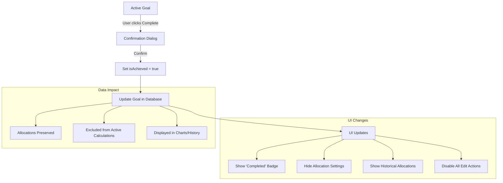

# Completed Goals

This document describes the behavior, UI changes, and data handling when a goal is marked as completed/achieved in WealthVN.

## Overview

When a user marks a goal as "achieved" (completed), the system transitions the goal to a read-only historical state while preserving all allocation data for reference and analytics.

### Key Behaviors

1. **Allocation Preservation**: Completed goals retain their allocations in the database for historical record
2. **Read-Only Mode**: All allocation editing is disabled for completed goals
3. **Allocation Release**: The allocated amounts are "released" back to the unallocated pool
4. **History Display**: Allocation history table shows contribution values at goal completion

---

## Data Model

### Goal `isAchieved` Flag

```typescript
interface Goal {
  id: string;
  title: string;
  targetAmount: number;
  isAchieved: boolean;  // Key flag for completed goals
  // ... other fields
}
```

When `isAchieved` is set to `true`:
- The goal is considered completed
- UI enters read-only mode
- Allocations are excluded from unallocated balance calculations for other goals

---

## Frontend Implementation

### Goal Details Page (`goal-details-page.tsx`)

The Goal Details Page adapts its layout based on the `isAchieved` status:

#### Header Section

For completed goals, a badge is displayed:

```tsx
{goal.isAchieved && (
  <span className="inline-flex items-center gap-1.5 rounded-full bg-green-100 px-3 py-1 text-sm font-medium text-green-700">
    <Icons.Check className="h-4 w-4" />
    {t("completedGoal.badge")}
  </span>
)}
```

#### Description Text

```tsx
{goal.isAchieved
  ? t("completedGoal.description")
  : t("details.description", { title: goal.title })
}
```

#### Hidden Sections

The "Allocation Settings" section (with Edit button) is completely hidden for completed goals:

```tsx
{!goal.isAchieved && (
  <div>
    {/* Allocation Settings section */}
  </div>
)}
```

#### Allocation History

For completed goals, the section title and description change:

```tsx
<h3>
  {goal.isAchieved ? t("completedGoal.allocationHistory") : t("details.allocations.title")}
</h3>
<p>
  {goal.isAchieved
    ? t("completedGoal.historyDescription")
    : t("details.allocations.description")
  }
</p>
```

#### Info Banner

A green info banner explains the allocation release:

```tsx
{goal.isAchieved && (
  <div className="mb-4 flex items-center gap-2 rounded-lg border border-green-200 bg-green-50 px-4 py-3 text-sm text-green-700">
    <Icons.InfoCircle className="h-4 w-4 shrink-0" />
    <span>{t("completedGoal.allocationsReleased")}</span>
  </div>
)}
```

#### Read-Only Mode

The `AllocationHistoryTable` receives a `readOnly` prop:

```tsx
<AllocationHistoryTable
  // ... other props
  readOnly={goal.isAchieved}
/>
```

---

### Goals Page (`goals-page.tsx`)

#### Complete Goal Action

Users can mark an active goal as completed:

```typescript
const handleCompleteGoal = async (goal: Goal) => {
  await updateGoalMutation.mutateAsync({
    ...goal,
    isAchieved: true,
  });
};
```

#### Status Display

The `getGoalStatus` utility handles completed goals:

```typescript
export function getGoalStatus(goal: Goal, isOnTrack: boolean) {
  if (goal.isAchieved) {
    return {
      text: "Done",
      colorClass: "text-success",
      statusText: "Completed",
      statusClass: "text-success bg-success/10",
    };
  }
  // ... other status logic
}
```

---

### Goal Item Component (`goal-item.tsx`)

Displays visual indicators for completed goals:

```typescript
// Progress bar color
const progressBarColor = goal.isAchieved ? "bg-primary" : (isOnTrack ? "bg-primary" : "bg-amber-500");

// Status check
if (goal.isAchieved) {
  return {
    label: "Completed",
    colorClass: "text-success",
  };
}
```

---

### Goal Operations (`goal-operations.tsx`)

The "Complete" action is only shown for non-achieved goals:

```tsx
{onComplete && !goal.isAchieved && (
  <DropdownMenuItem onClick={() => onComplete(goal)}>
    <Icons.Check className="mr-2 h-4 w-4" />
    {t("item.operations.complete")}
  </DropdownMenuItem>
)}
```

---

### Edit Allocation Modals

Both `edit-allocations-modal.tsx` and `edit-single-allocation-modal.tsx` check the goal status:

```typescript
interface Props {
  allGoals?: Goal[];  // All goals for checking isAchieved status
}

// Helper function
const isGoalCompleted = useMemo(() => {
  const goalInfo = allGoals?.find(g => g.id === goalId);
  return goalInfo?.isAchieved === true;
}, [goalId, allGoals]);
```

---

## Backend Implementation

### Goals Service (`goals_service.rs`)

#### Loading All Allocations

The `load_goals_allocations` method includes completed goals' allocations for display purposes:

```rust
fn load_goals_allocations(&self) -> Result<Vec<GoalsAllocation>> {
    // Use load_all_allocations to include completed goals' allocations (for display/chart)
    self.goal_repo.load_all_allocations()
}
```

### Goals Repository (`goals_repository.rs`)

Two methods for loading allocations:

```rust
/// Load allocations ONLY for active (non-achieved) goals - used for validation
fn load_allocations_for_non_achieved_goals(&self) -> Result<Vec<GoalsAllocation>>;

/// Load ALL allocations including from completed goals (for display purposes)
fn load_all_allocations(&self) -> Result<Vec<GoalsAllocation>>;
```

---

## Time-Aware Considerations

When calculating unallocated balance for new goals:

1. **Completed goals' allocations** are visible but do NOT reduce the unallocated balance
2. **Active goals' allocations** continue to reduce the unallocated balance
3. **Overlapping date ranges** are checked only for active goals

```typescript
// In edit-allocations-modal.tsx
const otherActiveAllocations = allAllocations.filter(alloc => {
  const goalInfo = allGoals?.find(g => g.id === alloc.goalId);

  // Skip allocations from completed goals
  if (goalInfo?.isAchieved) return false;

  // Skip allocations from the current goal being edited
  if (alloc.goalId === goal.id) return false;

  return true;
});
```

---

## Translation Keys

Located in `locales/en/goals.json` and `locales/vi/goals.json`:

```json
{
  "completedGoal": {
    "badge": "Completed",
    "description": "This goal has been achieved. All allocations are now released.",
    "allocationHistory": "Allocation History",
    "historyDescription": "Historical record of account allocations for this completed goal.",
    "allocationsReleased": "These allocations have been released. The allocated amounts are now available for other goals."
  }
}
```

---

## User Flow



---

## Related Documentation

- [Goal Page Business Logic](./Goal-page-logic.md)
- [Allocation Setting Plan](./allocation-setting-plan.md)
- [Goal Details Page](./goal-details-page.md)
