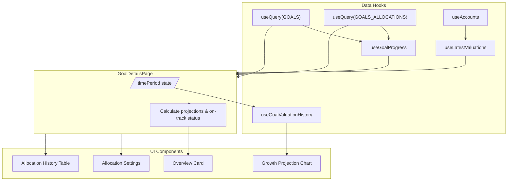
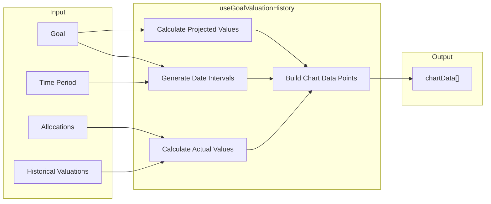
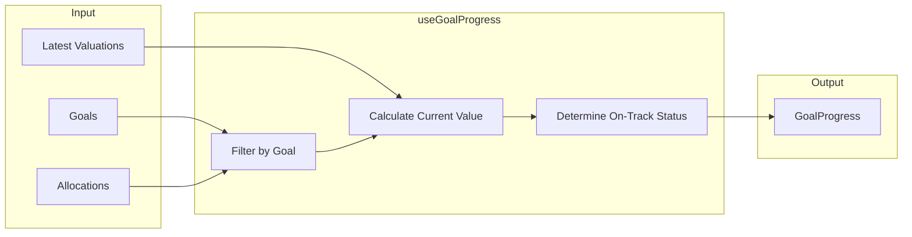

# Goal Detail Page

This document describes the structure, components, and logic of the **Goal Detail Page** (`src/pages/goals/goal-details-page.tsx`). This page provides an immersive view of a specific financial goal, tracking its progress, projected growth, and allocations.

## Table of Contents

1. [Overview](#overview)
2. [Page Structure](#page-structure)
3. [Key Components](#key-components)
4. [Data Fetching & Logic](#data-fetching--logic)
5. [User Interactions](#user-interactions)

---

## Overview

The Goal Detail Page is designed to answer three key questions for the user:
1. **"How am I doing?"** (Progress, On Track/Off Track status)
2. **"Will I reach my goal?"** (Growth Projection Chart)
3. **"How am I funding this?"** (Allocations)
### Details
- When user create a goal with minimal info: (Name, Target Amount,Return Rate, Start Date, Due Date), the system will calculate the monthly investment based on the goal's duration, target amount, and return rate.
- Initial the allocations will be set as 0 for all accounts.
- When user open the Goal detail page, user can see the Overview card, Growth Projection Chart, and Allocations section.
- Chart details:
  - Projected and actual value should be calculate by date.
  - Projected line:
    - Show the projected value depend on period selected, using the compounding formula for month.
    - In chart, projected line start on goal start date (initial value = daily investment) and end on goal due date(value ~ goal target amount).
    - In weeks period, the projected line will be show the projected value depend on period selected, and the compounding formula for date(end of weeks).
    - In months period, the projected line will be show the projected value depend on period selected, and the compounding formula for date(end of months).
    - In years period, the projected line will be show the projected value depend on period selected, and the compounding formula for date(end of years).
    - In all period, the projected line will be show the projected value depend on period selected, and the compounding formula for date(end of all).
    - The last point's projected value on chart = the Projected future value in Overview card and Projected future value should be changed following the time period selected.
  - **Actual line**:
    - Show the actual value depend on period selected.
    - In chart, the current week, month or year value should be equal Current Progress value in Overview card.
    - In chart, actual line start on goal start date (initial value = `initialContribution`) and end on current date.
    - Actual Value = Initial Contribution + (Account Growth × Allocation %).
    - The last point's actual value on chart = the Current Progress value in Overview card (logic ensures consistency).
  - Chart progress status. We have status for goal is on track or off track. The logic is: `if today's actual value >= projected value -> goal is on track`. The color of actual line will be green if on track and red/amber if off track.

- **Overview card**:
  - **Target Amount**: Large display of the goal's target.
  - **Current Progress**: Percentage completion and current contributed value (Total Value).
  - **Metrics Grid**: Compact 2x2 grid showing:
    - **Monthly Investment (DCA)**: The monthly contribution amount set on the goal.
    - **Target Return Rate**: User input annual return rate.
    - **Time Remaining**: Calculated time until proper Due Date.
    - **Projected Future Value**: Value calculated using daily compounding of contributions at the selected period end date.

 Example:
  - This is example of goal: Mua nha, 1,000,000,000, 8%, 5 year, 1/1/2025, 1/1/2030, Initial 200,000,000.
  - The system back-calculates the required daily investment to bridge the gap between (Initial + Growth) and Target.
  - The projected future value displayed will be the Target Amount minus the projected growth of the Initial Principal (since projection line tracks contributions).
  - Current Progress shows the Total Actual Value (Initial + Growth).

## Page Structure

The page uses a responsive layout with the following sections:

### 1. Header
- **Title & Description**: Displays the goal's name and description.
- **Actions**:
  - `Edit Goal`: Opens the `GoalEditModal`.
  - `Back`: Navigates back to the main goals list.

### 2. Main Grid
A responsive grid layout (2 columns on desktop for the chart, 1 column for overview stats).

- **Left/Center (Desktop): Growth Projection Chart**
  - Displays a visual comparison between "Actual Value" and "Projected Growth" over time.
  - Allows toggling time periods (Weeks, Months, Years, All).

- **Right (Desktop): Overview Card**
  - **Target Amount**: Large display of the goal's target.
  - **Current Progress**: Percentage completion and current currency value.
  - **Metrics Grid**: Compact 2x2 grid showing:
    - Monthly Investment
    - Target Return Rate
    - Time Remaining
    - Projected Future Value

### 3. Allocations Section
- **Allocation Settings**: A read-only Gantt-style view of how this goal is funded across accounts.
- **Current Allocations**: A detailed table (`AllocationHistoryTable`) listing individual allocation records, allowing users to edit amount/percentage or delete allocations.

---

## Key Components

### 1. Growth Projection Chart
- **Library**: `recharts`
- **Type**: `AreaChart`
- **Data Hook**: `useGoalValuationHistory`
- **Features**:
  - **Projected Area**: Dashed line indicating the ideal path to the target.
  - **Actual Area**: Solid line (green/amber) showing real progress.
  - **Gradient Fills**: Adds depth to the chart areas.
  - **Tooltip**: Custom tooltip showing values at specific dates.
  - **Color Logic**: The "Actual" line color changes based on on-track status (Green if on track, Amber if off track).

#### Logic & Calculations
The chart combines two distinct data sets into a unified time series:

1.  **Projected Value (Ideal Path)**:
    - Calculated using a **daily compounding** formula to generate a smooth curve.
    - Starts from 0 (at Goal Start Date) and grows based on `monthlyInvestment` and `targetReturnRate`.
    - **Formula**: `FV = PMT × [((1 + r)^n - 1) / r]` (where contributions are monthly/daily equivalents).

2.  **Actual Value (Real Progress)**:
    - Aggregated from historical account valuations (`getHistoricalValuations`).
    - Derived using the **proportional growth attribution** method:
      `Allocated Value = Initial Contribution + (Account Growth × Allocation %)`
    - Points are fetched for the entire relevant history and then aggregated by the selected time period (e.g., end-of-week, end-of-month).

#### Time Periods
The hook `useGoalValuationHistory` handles data aggregation based on the selected period:

| Period     | Logic               | Range                            |
| :--------- | :------------------ | :------------------------------- |
| **Weeks**  | End-of-week values  | +/- 12 weeks from today          |
| **Months** | End-of-month values | +/- 12 months from today         |
| **Years**  | End-of-year values  | +/- 3-5 years from today         |
| **All**    | Yearly intervals    | From Goal Start Date to Due Date |

**Note**: For the "All" view, the chart ensures the exact **Goal Due Date** is included as the final data point to show the target completion value.

### 2. MetricDisplay
A reusable component for showing key-value pairs in the Overview Card.
- Used for: Monthly Investment, Return Rate, Time Remaining, etc.

### 3. AllocationHistoryTable
- Displays the list of accounts funding this goal.
- Shows "Initial Contribution", "Allocated %", and calculated "Contributed Value".
- Provides `Edit` and `Delete` actions for each allocation.

### 4. EditAllocationsModal
- A modal for adding or modifying allocations.
- Logic includes:
  - Validating 100% allocation items cap.
  - Checking available unallocated balance.
  - Prefilling existing values.

---

## Data Fetching & Logic

### Data Sources
The page relies on several React Query hooks:
1. `useQuery([QueryKeys.GOALS])`: Fetches the specific goal details.
2. `useQuery([QueryKeys.GOALS_ALLOCATIONS])`: Fetches allocation records.
3. `useLatestValuations(accountIds)`: Fetches real-time account balances to calculate current value.
4. `useGoalValuationHistory`: A specialized hook that generates the time-series data for the chart.

### Core Calculations

#### 1. Daily Investment (Reverse Engineering)
To determine if a goal is on track, the system first calculates the required daily investment to hit the target by the due date.
**Crucially**, this calculation *does* account for the `startValue` (Initial Principal). It finds the contribution needed to fill the gap between the Target and the Future Value of the Initial Principal.

```typescript
const dailyInvestment = calculateDailyInvestment(
  startValue,
  goal.targetAmount,
  annualReturnRate,
  startDate,
  dueDate,
  // Formula: Amount needed to fill (Target - FutureValue(Start))
);
```

#### 2. Projected Value
Using the calculated daily investment, we project the growth of *future contributions* to today's date (or any chart date).
*Note: The `calculateProjectedValueByDate` function calculates the accumulated value of these daily investments only.*

```typescript
projectedValueToday = calculateProjectedValueByDate(
  startValue, // Passed but unused in this specific function
  dailyInvestment,
  annualReturnRate,
  startDate,
  today,
);
```

#### 3. On-Track Status
A simple comparison determines the status color (Green/Amber):

```typescript
onTrack = currentAmount >= projectedValueToday;
const actualColor = onTrack ? "var(--chart-actual-on-track)" : "var(--chart-actual-off-track)";
```

---

## User Interactions

| Action | Description |
| :--- | :--- |
| **Change Time Period** | Clicking the toggle (Weeks/Months/Years) updates the `timePeriod` state, triggering `useGoalValuationHistory` to re-aggregate data. |
| **Edit Goal**          | Opens `GoalEditModal` to update title, target, dates, etc.                                                                          |
| **Edit Allocations**   | Opens `EditAllocationsModal` to change funding sources.                                                                             |
| **Delete Allocation**  | Clicking the trash icon in `AllocationHistoryTable` calls `deleteAllocationMutation` to remove funding.                             |

---

## Data Flow Diagram

This section illustrates how data flows through the Goal Detail Page frontend.

### Page Data Flow



### Chart Data Flow



### Goal Progress Flow



---

## Related Documentation

- [Goal Page Business Logic](./Goal-page-logic.md)
- [Projected Value Business Logic](./projected-value-business-logic.md)
